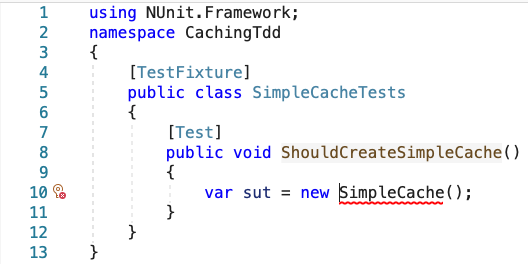
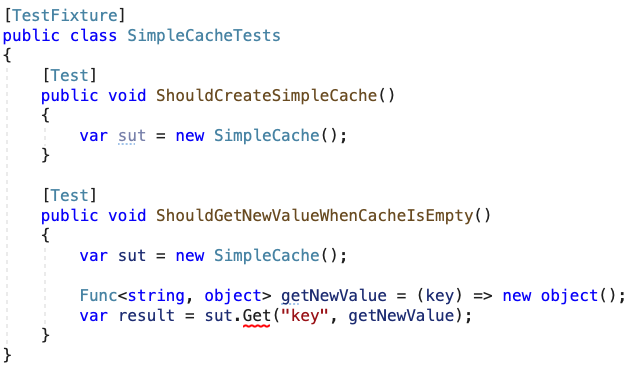
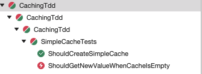
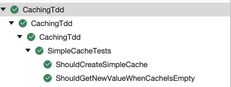
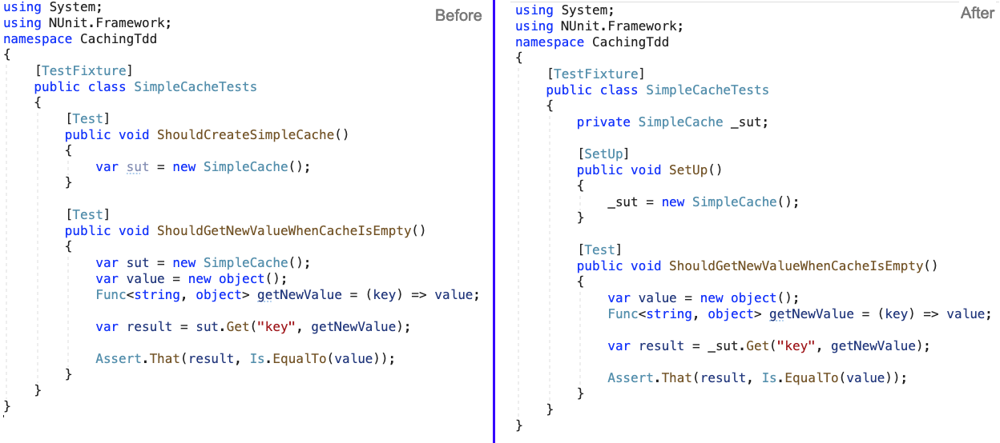
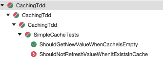
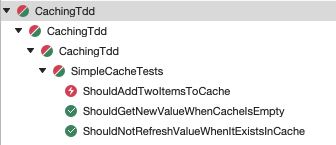
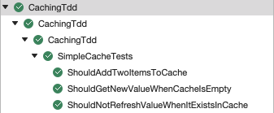

# Caching TDD

Scope of this project is to build a caching algorithm in C# using Test Driven Development. I'll implement a simple key-value pair cache and for simplicity, I won't consider expiration time. I will implement a generic cache where key is a simple string while value can be any object type.

## Start with nothing
We should start with an empty test only to verify that we have a running pipeline.
```csharp
[Test]
public void Nothing()
{
}
```
Let's run the tests


## Create a test that forces me to create SUT
Since we've proved we have a working pipeline, let's delete the first dummy test and let's create a test that forces us to create our System Under Test (which is SimpleCache class).



Since this is a failing test, we're forced to write a simple production code that makes this test to pass.


## Empty cache -> get new value.
The first test I'm thinking is that we have an empty cache and we need get a fresh new value.
This means we need a `Get` method where we can pass an identifer and some other method that will be called to give me the new value when identifier doesn't exist.



Since we want to make this cache generic, we don't know what function will be used to get values, so we'll defind the shape of it. It's a function that gets a string as input and it returns any object.
This test, the way it is, forces me to create the production Get method definition. So our SimpleCache class would look like this:
```csharp
public class SimpleCache
{
  public object Get(string key, Func<string, object> getNewValue)
  {
      return null;
  }
}
```
Switching back to the test, we need to add my Assertion. We're going to save the new object returned by the inline function into a variable and we're going to assert that would be the value returned by `sut.Get` call.
```csharp
[Test]
public void ShouldGetNewValueWhenCacheIsEmpty()
{
  var sut = new SimpleCache();
  var value = new object();
  Func<string, object> getNewValue = (key) => value;

  var result = sut.Get("key", getNewValue);

  Assert.That(result, Is.EqualTo(value));
}

```


What's the easiest way to make it pass? Well, call `getNewValue` function and return its result.
```csharp
public T Get(string key, Func<string, T> getNewValue)
{
  return getNewValue(key);
}
```
And tests are passing!



Now, the test class has some duplicate code which we can refactor and the result would be this:


## Do not refresh the value when it exists in cache.

This means if we call `Get` two times, we should receive the same value.
```csharp
[Test]
public void ShouldNotRefreshValueWhenItExistsInCache()
{
  var myvalue = new object();
  Func<string, object> getNewValue = (key) => myvalue;

  var firstValue = _sut.Get("key", getNewValue);
  var secondValue = _sut.Get("key", getNewValue);

  Assert.That(firstValue, Is.EqualTo(secondValue));
  Assert.That(firstValue, Is.EqualTo(myvalue));
}
```
And this test with fail with our current production code.

The simplest way we could fix this is to save the returned value into a class property and return it next time the `Get` method gets called.
```csharp
public class SimpleCache
{
  private object _value;
  public object Get(string key, Func<string, object> getNewValue)
  {
    if (_value == null)
    {
      _value = getNewValue(key);
    }
    return _value;
  }
}
```


Now we can refactor. It would make sense to add the generic type as class level and use it as a type for the `_value` property. So we can change first our tests to make them decide what is the type of values we're goint to store in our simple cache.
```csharp
private SimpleCache<object> _sut;

[SetUp]
public void SetUp()
{
  _sut = new SimpleCache<object>();
}
```
Now, project won't compile and we're allowed to add the generic type as part of the SimpleCache production class.
```csharp
public class SimpleCache
{
  private object _value;
  public object Get(string key, Func<string, object> getNewValue)
  {
    if (_value == null)
    {
      _value = getNewValue(key);
    }
    return _value;
  }
}
//becomes
public class SimpleCache<T>
{
  private T _value;
  public T Get(string key, Func<string, T> getNewValue)
  {
    if (_value == null)
    {
      _value = getNewValue(key);
    }
    return _value;
  }
}
```
Now, making sure our tests still pass.


## Getting another value from cache by a different key.
So, we have a scenario where we add a value to cache and we see that it gets stored and never refreshed once it gets there.
Let's try to write a test to add two values identified by two different keys and when we try to get them, they obiovsly need to be consistent with what we added.
Test would look like this:
```csharp
[Test]
public void ShouldAddTwoItemsToCache()
{
    var myvalue1 = new object();
    var myvalue2 = new object();
    Func<string, object> getNewValue1 = (key) => myvalue1;
    Func<string, object> getNewValue2 = (key) => myvalue2;

    var firstValue = _sut.Get("key1", getNewValue1);
    var secondValue = _sut.Get("key2", getNewValue2);

    Assert.That(firstValue, Is.EqualTo(myvalue1));
    Assert.That(secondValue, Is.EqualTo(myvalue2));
}
``` 
And when we run the test, we'll have one failed test.


Now, let's try to implement. Obviously, our production code doesn't store the value retrieved by the function based on the key. One way to store values by keys, is to use a Dictionary.
```csharp
public class SimpleCache<T>
{
  private IDictionary<string, T> _cachedValues = new Dictionary<string, T>();
  public T Get(string key, Func<string, T> getNewValue)
  {
    if (!_cachedValues.ContainsKey(key))
    {
      _cachedValues.Add(key,getNewValue(key));
    }
    return _cachedValues[key];
  }
}
```
Now, let's run the tests: All tests pass!



## Concurrent calls
Our simple cache might be called in a multi-thread environmnet, so multiple threads can try to get/add values into the cache. Also giving the control for the client to implement the function described in the definition, does not guarantees a thread safe implementation of the function. In this particular case we want to allow only one thread in the body of our method.
But let's write a failing test first. One way, is to use Parallel.ForEach:
```csharp
[Test]
public void ShouldNotCallTheGetNewValueMethodMultipleTimes()
{
  var numberOfCalls = 0;
  Func<string, object> getNewValue = (key) =>
  {
    numberOfCalls += 1;
    return new object();
  };
  var iterations = new[] { 1, 2, 3, 4 };
  Parallel.ForEach(iterations, iteration =>
  {
    _sut.Get("key", getNewValue);
  });

  Assert.That(numberOfCalls, Is.EqualTo(1));
}
```


Of course, test fails but not with the expected reason. It fails because adding multiple times the same key to a dictionary, it causes an exception:
```
An item with the same key has already been added. Key: key
```
One easy way to fix this, is to wrap the `_cachedValues.Add(key, value);` in a `try/catch` block and then running again the test.
```csharp
 public T Get(string key, Func<string, T> getNewValue)
{
  if (!_cachedValues.ContainsKey(key))
  {
    var value = getNewValue(key);
    try
    {
      _cachedValues.Add(key, value);
    }
    catch { }
  }
  return _cachedValues[key];
}
```
Now let's run the tests.


Test fails again, but this time for the reason specified in the assertion:
```
  Expected: 1
  But was:  4
```
To fix it,  we need to lock before trying to verify if the key is contained in the dictionary. 
```csharp
public class SimpleCache<T>
{
  private object _locker = new object();

  private IDictionary<string, T> _cachedValues = new Dictionary<string, T>();
  public T Get(string key, Func<string, T> getNewValue)
  {
    lock (_locker)
    {
      if (!_cachedValues.ContainsKey(key))
      {
        var value = getNewValue(key);
        try
        {
            _cachedValues.Add(key, value);
        }
        catch { }
      }
      return _cachedValues[key];
    }
  }
}
```


We're under green state, so we can refactor and remove the try/catch block. Refactored code would look like this:
```csharp
public class SimpleCache<T>
{
  private object _locker = new object();

  private IDictionary<string, T> _cachedValues = new Dictionary<string, T>();
  public T Get(string key, Func<string, T> getNewValue)
  {
    lock (_locker)
    {
      if (!_cachedValues.ContainsKey(key))
      {
        var value = getNewValue(key);
        _cachedValues.Add(key, value);
      }
      return _cachedValues[key];
    }
  }
}
```
Running again the tests to make sure everything is good:

